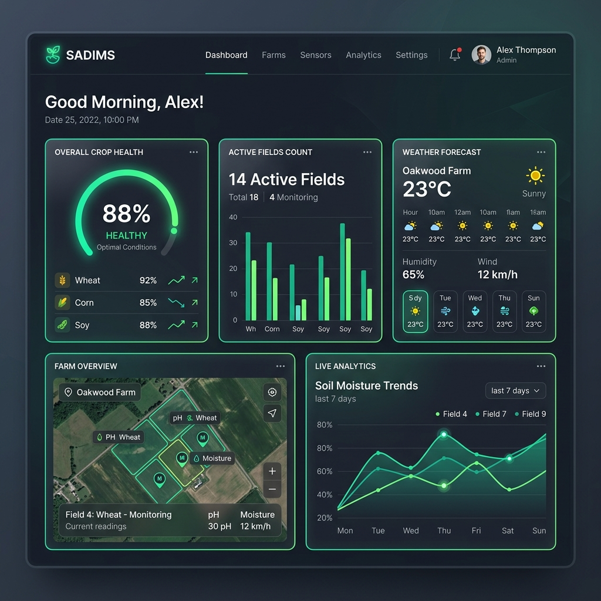
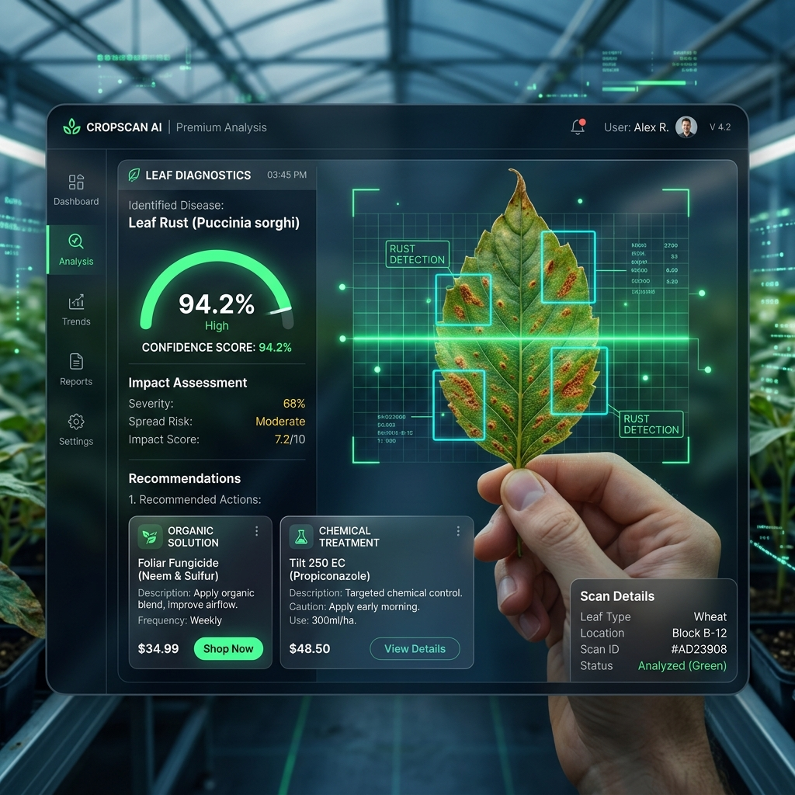
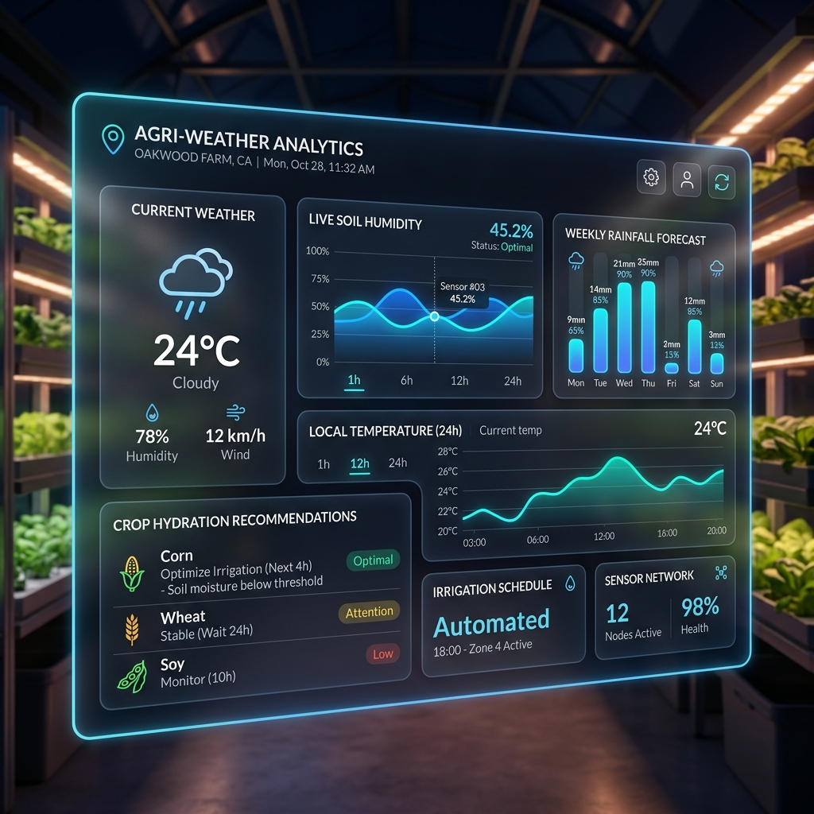

# 🌾 SADIMS | Smart Agro-Defence Intelligence & Monitoring System

Welcome to **SADIMS** (Smart Agro-Defence Intelligence & Monitoring System), a state-of-the-art, AI-powered agricultural monitoring platform. SADIMS is designed to help farmers protect their fields, optimize crop yields, and manage multiple farms efficiently using modern AI disease detection, real-time weather analytics, and structured database logging.

---

## 📸 Application Preview & Screenshots

Here is a visual overview of the premium dashboard interface, neural scanning lab, and climate logic systems:

### 🖥️ Farmer & Admin Dashboard
A modern glassmorphic dashboard showcasing live crop health statistics, active fields, meteorological alerts, and farm portfolio overview.


### 🔬 Neural Scan Lab (AI Disease Detection)
A futuristic AI-powered scanner identifying crop leaf diseases (such as Leaf Rust, Blight, Powdery Mildew, etc.) with real-time confidence scores and providing organic and chemical remedy recommendations.


### 📊 Climate Logic (Weather Intelligence)
Integrates real-time localized weather logs (temperature, humidity, rainfall) alongside precision soil hydration metrics to optimize irrigation.


---

## 🚀 Key Features

*   **🌱 Smart Farm Portfolio:** Add and manage multiple farms, specifying location, soil profile, and crop varieties in a unified interactive dashboard.
*   **🧠 Neural Scan Lab (AI Disease Detection):** Upload high-resolution leaf images for instantaneous AI-driven diagnosis of various plant diseases, including:
    *   *Leaf Rust, Powdery Mildew, Blight, Tomato Early Blight, Potato Late Blight, Wheat Rust, Rice Blast, Corn Common Rust, Apple Scab, Grape Black Rot, and Healthy crops.*
*   **🧪 Dual Treatment Protocols:** Provides instant, detailed mitigation actions categorizing both **Organic Solutions** (e.g., neem oil, bio-fungicides) and **Chemical/Inorganic Solutions** (e.g., Mancozeb, copper sulfate) to combat infections.
*   **☁️ Climate Logic (Weather Intelligence):** Log and track localized weather metrics (temperature, humidity, rainfall) mapped directly to your fields.
*   **👥 Role-Based Command Hubs:**
    *   **ADMIN Dashboard:** Oversee all registered farms globally, review diagnostic history, and manage weather monitoring.
    *   **FARMER Hub:** Register personal fields, run custom leaf diagnostics, keep track of localized weather logs, and access tailored farming recommendations.

---

## 🛠️ Technology Stack

SADIMS utilizes a distributed microservices-style architecture to ensure performance, modularity, and scalability:

1.  **Frontend (UI/UX Layer):**
    *   Built using clean, semantic **HTML5**, modern **Vanilla CSS3**, and asynchronous **JavaScript**.
    *   Features glassmorphic styling, custom smooth CSS animations, high-contrast typography (Inter & Outfit), and responsive layout support.
    *   Uses **Lucide Icons** for a premium interface aesthetic.
2.  **Backend Service:**
    *   Powered by **Java Spring Boot 17+** / **Spring MVC**.
    *   Utilizes **Spring Data JPA** for data persistence and **Hibernate** ORM.
    *   Integrates with a **PostgreSQL** database for secure registration, authentication logging, farm tracking, disease records, and weather logging.
3.  **ML Service:**
    *   Built on a **Python Flask** server.
    *   Acts as an inference API serving mock deep-learning neural network logic mapped to a comprehensive agricultural knowledge base (`disease_solutions.json`).
    *   Computes confidence percentages, disease diagnostics, and detailed treatment plans dynamically.

---

## ⚙️ Local Installation & Running Guide

### 📋 Prerequisites
Before launching SADIMS, ensure you have the following installed on your machine:
*   **Java JDK 17+** (Java 25 LTS is fully supported)
*   **Python 3.10+** (with `pip` configured)
*   **PostgreSQL Server** (listening on port **2178**)

### 🔌 Database Setup
1.  Ensure your **PostgreSQL** is running (Port 2178) and 'sadims_db' is created.
2.  Create a blank database named **`sadims_db`**.
3.  The application uses local PostgreSQL credentials:
    *   **Username:** `your_postgres_username`
    *   **Password:** `your_postgres_password`
    *   *(Note: Set your actual username and password in [application.properties](file:///c:/Users/Khushveer/AntiGravity/SADIMS/backend/src/main/resources/application.properties) before running the application.)*
4.  *Note: With `ddl-auto=update`, Spring Boot will automatically generate the required database tables and seed default admin credentials on the first run!*

### ⚡ Quick Start (Windows)
We provide two pre-configured batch scripts at the root directory:

1.  **To Launch SADIMS:**
    Double-click `start_sadims.bat` or run it from a terminal. This script will:
    *   Verify Java and Python installations.
    *   Check for active PostgreSQL connections on port 2178.
    *   Launch the **Spring Boot Backend** (`mvnw.cmd spring-boot:run`) in a new console window.
    *   Launch the **Python ML Service** (`python app.py`) in a second console window.
    *   Wait 15 seconds, then open the browser interface (`frontend/index.html`) automatically.

2.  **To Stop SADIMS:**
    Double-click `stop_sadims.bat` or run it from a terminal to cleanly terminate all background Java and Python processes associated with the project.

---

### 🛠️ Manual Execution (All Operating Systems)

If you prefer to start the services manually in separate terminals:

#### 1. Start Python ML Service:
```bash
cd ml_service
pip install -r requirements.txt
python app.py
```
*This will start the Flask server on `http://localhost:5000`.*

#### 2. Start Spring Boot Backend:
```bash
cd backend
# On Windows:
mvnw.cmd spring-boot:run
# On Linux/macOS:
chmod +x mvnw
./mvnw spring-boot:run
```
*This will build, compile, and start the Tomcat backend on `http://localhost:8080`.*

#### 3. Start Frontend:
Simply double-click or open `frontend/index.html` in any modern web browser to log in and start using SADIMS!

---

Developed with ❤️ for Modern & Sustainable Agriculture.
